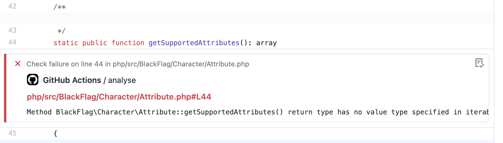

[](//packagist.org/packages/ludofleury/github-annotation-path-mapper)
[](//packagist.org/packages/ludofleury/github-annotation-path-mapper) 
[](//packagist.org/packages/ludofleury/github-annotation-path-mapper)

# Github annotation path mapper

**TL;DR: Basically `| sed ""` in php with sigterm 2 if a replacement occurs.**

Prefix github annotation file location from github action workflow command.

Typically, if you are running your github action in a docker container, 
and the directory structure does not match your git repository.

Coded in PHP for PHP projects.

## Example use case

* git repository base path: **backend/src/**
* docker base path: **src**

Considering a git repository like this:

- .git/
- frontend/
- backend/composer.json
- backend/src/File1.php
- backend/src/File2.php
- backend/vendors/*
- backend/tests/*

if you run phpstan in this kind of docker container, the *STDOUT* will be `src/File1.php` and github annotation will fail to match the path.
```bash
docker run --volume backend/:/app php /app/vendors/bin/phpstan analyse --error-format=github

# ::error file=src/File1.php,line=10,col=15::Something went wrong
```
 

:rescue_worker_helmet: But piping to this tiny lib will adjust the *STDOUT* to `backend/src/File1.php`
```bash
phpstan analyse --error-format=github | vendor/bin/github-annotation-mappe backend/

::error file=backend/src/File1.php,line=10,col=15::Something went wrong
```


And github annotation will finally appear inlined with your code in your PR!



## Setup

```bash
$ composer require --dev ludofleury/github-annotation-path-mapper
```

or git clone, copy paste, whatever.

## Usage

Simply pipe to the bin mapper
```
$ my-command-to-run | vendor/bin/github-annotation-mapper [path prefix with trailling slash]
```

